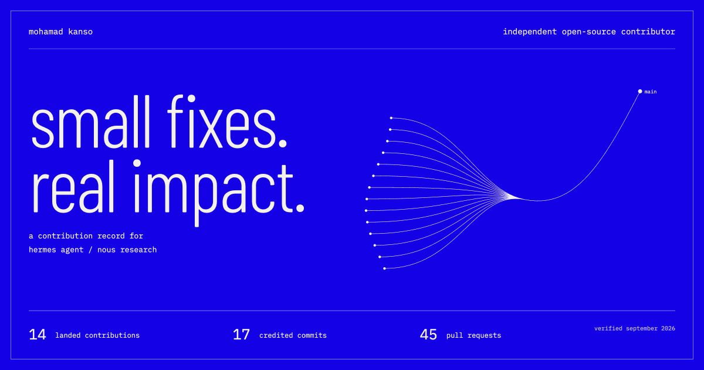

# hermes contributions

my open-source work on hermes agent, with the code and the credit behind it.

[open the site](https://mohamadkanso.github.io/hermes-contributions/)



## the record

snapshot checked on 20 september 2026

- 14 distinct contributions connected to merged upstream prs
- 8 authored and 9 co-authored commits on main
- 45 original pull requests: 24 open, 21 closed
- 0 original prs merged directly. accepted work was integrated through maintainer prs
- 83 distinct commit objects inspected, including 66 in the original pr histories
- 47 related issues, none claimed as authored by me
- 39 explicit mention records by other accounts, 34 by teknium. these include coordination and criticism, not just praise

the six case studies explain the problem, what changed, and my exact part in the result. the archive includes every original pr in the audit, all reachable commit records, the related issues and the mention sources.

this is an independent contributor portfolio, not an official nous research website. a co-author credit is not a claim that i wrote the whole merged change. see [the audit notes](docs/audit.md).

## run it

requires node 20.19+ or a supported newer release. tested with node 24.

```sh
npm ci
npm run dev
npm test
npm run build
```

the site is plain html, css and javascript bundled with vite. all fonts and evidence data are local. there are no analytics, cookies, trackers, live github tokens or server dependencies in the published site.

## refresh the evidence

the public page is intentionally a dated snapshot. no scheduled updates silently change the attribution.

with the github cli authenticated and a local hermes checkout available:

```sh
node scripts/audit.mjs --refresh
HERMES_SOURCE=/absolute/path/to/hermes-agent node scripts/expand-audit.mjs
node scripts/expand-issues.mjs
```

then review `scripts/curation.mjs` against the fresh source. update the accepted integration map, summaries and quotes explicitly. `node scripts/build-data.mjs` refuses an unknown contribution or an unverified quote. run the tests and build, update the audit date and social image, then commit the reviewed result.

`.audit/` contains the raw local responses and is not published. `public/data/contributions.json` is the stripped-down public record. it excludes commit emails, local paths, credentials and raw comment bodies.

github pages deploys from the `main` branch through the included workflow.

## design

inspired by the blue, fine texture and condensed type of [hermes](https://hermes-agent.nousresearch.com/), and the quieter editorial layout of [nous research](https://nousresearch.com/). the code, layout and interactive contribution drawing are original. the image-generated layout study is not shipped and none of its placeholder text is used.

fonts are barlow condensed and ibm plex mono, under the sil open font license. code excerpts retain the hermes mit license. see [reuse notes](THIRD_PARTY_NOTICES.md).
